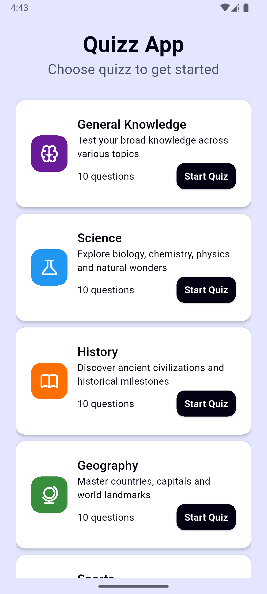
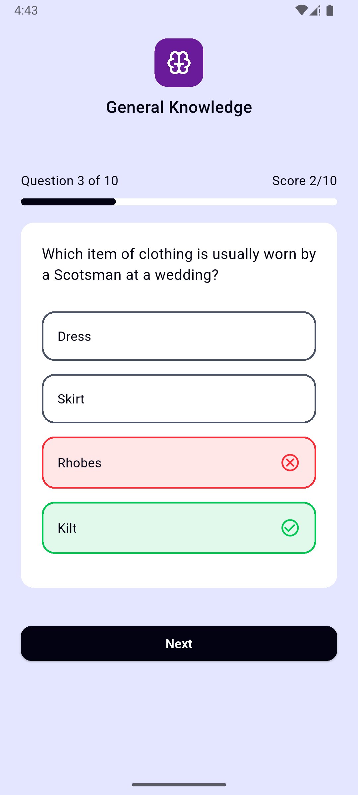
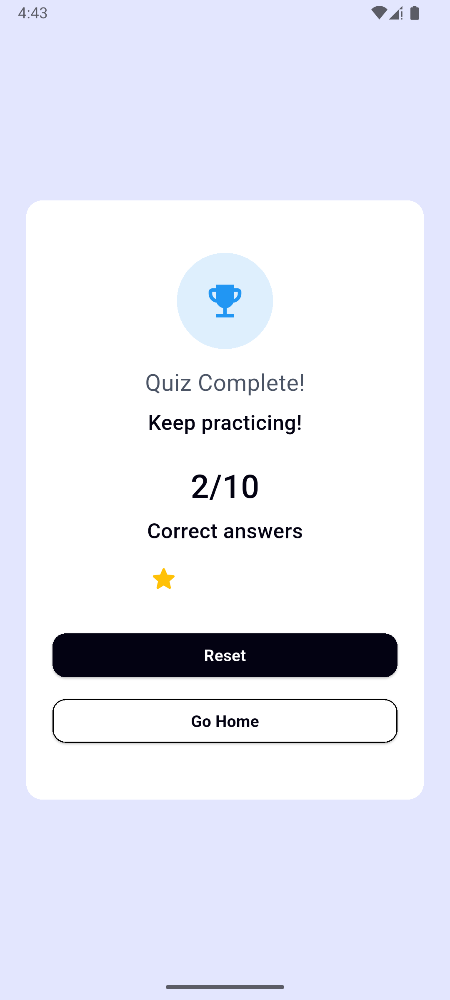

# quizz_app

Flutter quiz app built with GetX, Dio, and Dartz. Users pick a category, answer questions, and view a results screen with score and rating.

## Screenshots

Images live in `assets/screenshots/`:

| Home                                 | Quiz                                 | Results                                    |
| ------------------------------------ | ------------------------------------ | ------------------------------------------ |
|  |  |  |

## Project Structure

- `lib/core/`
  - `models/` – shared data models (e.g., `QuizzCategoryModel`).
  - `utils/` – routing (`app_router.dart`), styling (`app_style.dart`), constants (`constants.dart`), generated assets (`assets.dart`).
  - `extension/` – UI helpers (gaps, colors, etc.).
- `lib/features/home/` – category listing UI and shared widgets.
- `lib/features/quizz/` – quiz flow: `QuizController` (state), models, views, and widgets.
- `lib/features/result/` – result screen widgets and view.
- `core/interface/quiz_repo.dart` – abstraction for fetching quiz data; implemented by your data layer (using Dio).

## Tech Stack

- Flutter (Material 3)
- State management: GetX (`GetxController`, `Obx`)
- Navigation: GetX routes (`AppRouter`)
- Networking: Dio
- Functional error handling: Dartz `Either`
- Asset generation: `flutter_assets` (produces `lib/core/utils/assets.dart`)

## Getting Started

Prerequisites: Flutter SDK (3.19+ recommended), Dart 3.9+, device/emulator set up.

```bash
flutter pub get
# (optional) regenerate asset references if you change assets
flutter pub run flutter_assets
```

## Run

```bash
flutter run
```

## Build

- Android release APK:

```bash
flutter build apk --release
```

- iOS (from macOS):

```bash
flutter build ios --release
```

## App Flow

1. Pick a category from Home.
2. Quiz starts; questions come from `QuizRepo.fetchQuizByCategoryId`.
3. Submit answers; progress and score tracked in `QuizController`.
4. On completion, Result screen shows trophy, score `x/total`, stars, and actions to reset or go home.

## Notes

- Update `assets/images/` then re-run `flutter pub run flutter_assets` to refresh `assets.dart`.
- If you add a new API backend, implement `QuizRepo` accordingly and wire it into GetX DI where the controller is created.
